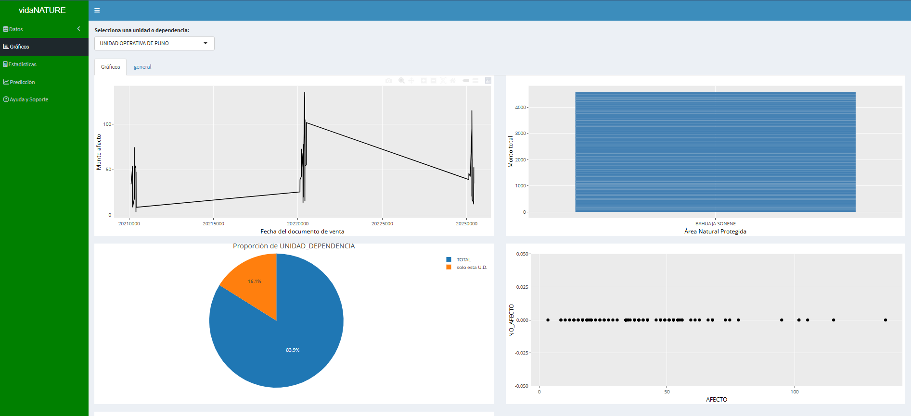
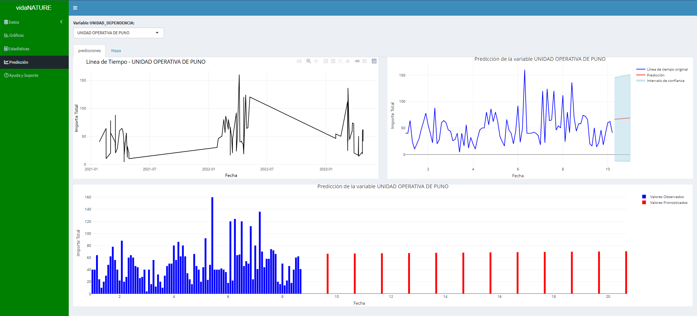

# Visualización de la Recaudación para Areas Naturales Protegidas (ANP) en Perú

## 🇵🇪 Descripción del Proyecto

Este repositorio aloja la aplicación interactiva desarrollada con **R Shiny** para visualizar y analizar los datos de **Recaudación Económica** destinados a la **Protección de las Áreas Naturales Protegidas (ANP)** del Perú.

---

## 🛠️ Herramientas y Tecnologías

El dashboard fue construido completamente en el ecosistema de R, aprovechando las siguientes herramientas:

| Categoría | Herramienta | Uso Principal |
| :--- | :--- | :--- |
| **Lenguaje** | **R** | Procesamiento de datos y lógica de la aplicación. |
| **Dashboard** | **Shiny** | Framework principal para la construcción de la interfaz web interactiva. |
| **Visualización** | **`ggplot2`**, **`plotly`** | Creación de gráficos y mapas dinámicos. |
| **Manipulación** | **`dplyr`**, **`data.table`** | Transformación, limpieza y agregación de los datos. |

---

## 🚀 Despliegue y Acceso

La aplicación está desplegada y disponible de forma pública para su uso interactivo.

Puedes acceder a la aplicación directamente aquí:

👉 **[Abrir la Shiny App (vidaNATUREapp)](https://qe7j2m-alex-raul0cruz.shinyapps.io/vidaNATUREapp/)**

---

## 
📸 ****
📸 ****

Desarrollado en 2022
## 📄 Licencia

Este proyecto está bajo la Licencia MIT.
